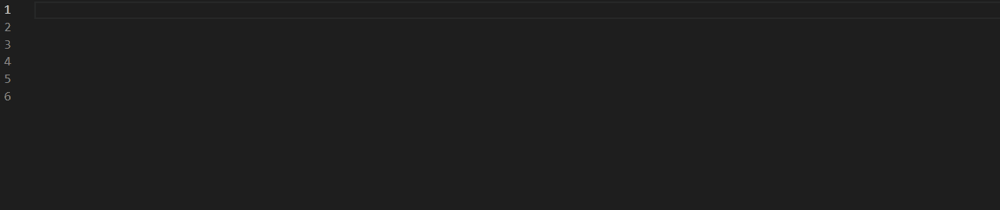
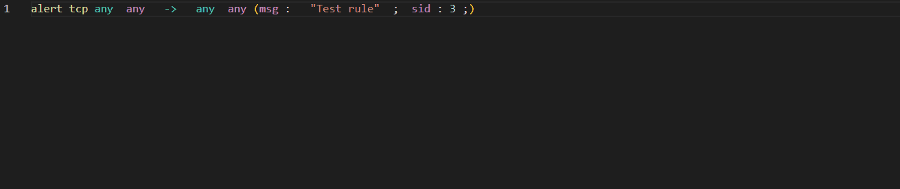
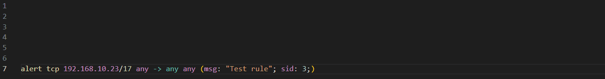
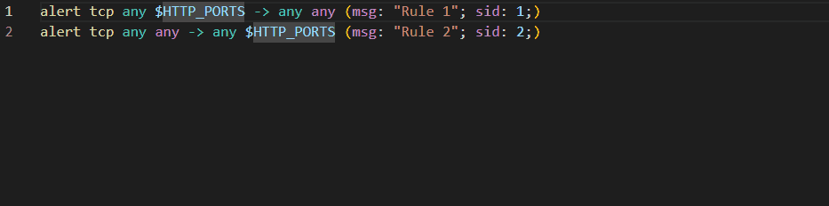
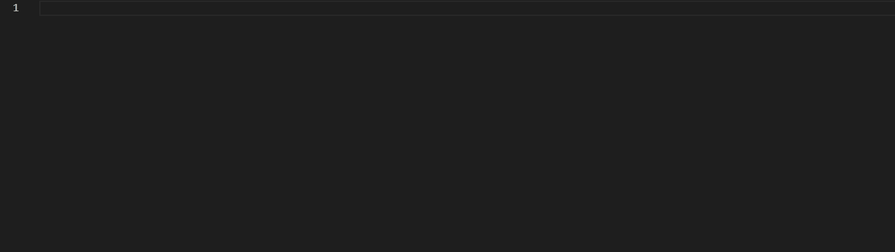
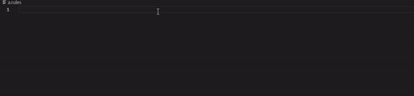
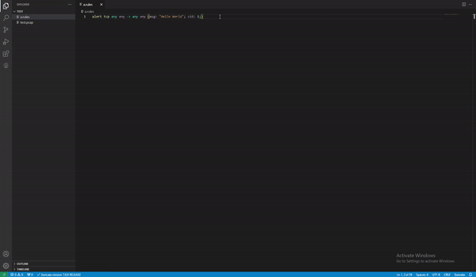

# Meerkat for VS Code

Suricata/Snort formatter extension for VS Code

## Features
Meerkat provides the following features:
- Syntax highlighting
### Signature checking with suricata


### Signature formatting

*The Auto-formatting uses the default hotkeys in your code editor*

### Hover information


### Variable references/renaiming

*The rename feature uses the default hotkeys in your code editor*

### Code completion


### Code snipplets


### PCAP Testing


**Warning:** pcap visualization only works if additional third party extenssions are installed. Please install one of the available extenssions to be able to open pcap files in VS Code.

- Rule linting (TOOD)
- Rule performance statistics (TODO)

## Installation troubleshooting
### Unexpected token '?'
If you get the following error:
```
SyntaxError: Unexpected token '?'
    at wrapSafe (internal/modules/cjs/loader.js:915:16)
    at Module._compile (internal/modules/cjs/loader.js:963:27)
```
The issue is most probably the version of the Node that you're using.

### Vulnerabilities, while installing with npm
The issue is most probably related to the version of npm used. Try updating npm:
```
npm update
```
This command should tell you if you have an older version of npm and give you the line you need to run to update it
